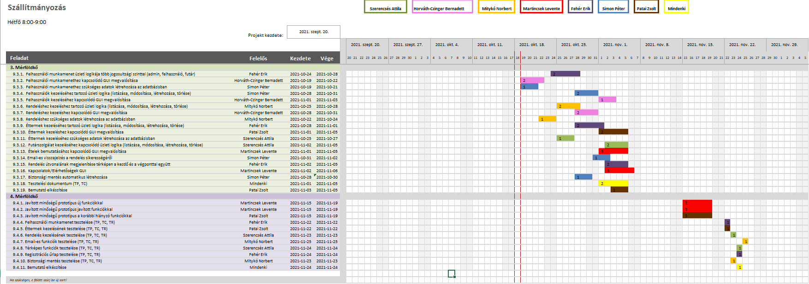

# Étel Projektterv 2021

## 1. Összefoglaló 

A Webpincér célja, hogy minél olcsóbban és minél gyorsabban tudjon az ügyfél választani az általa kedvelt éttermek és ételek közül. Ehhez egy online webalkalmazást készítünk amelyben éttermek széles választéka elérhető. Rengeteg étel és ital közül választhatnak a megrendelők. A weboldal biztosítja a megfelelő tájékoztatást a megrendelők számára. Információt biztosít az étel árakkal kapcsolatban, és a különböző szállítási költségekkel is.

## 2. Verziók

| Verzió | Szerző(k)                | Dátum        | Státusz         | Megjegyzés                                                    |
|--------|--------------------------|--------------|-----------------|---------------------------------------------------------------|
| 0.1  | Szerencsés Attila             | 2021-09-26 | Tervezet      | Legelső verzió                                              |
| 0.2  | Horváth-Czinger Bernadett Martincsek Levente | 2021-10-04 | Előterjesztés | A projekt menedzsere jónak találta                          |
| 1.0  | Patai Zsolt               | 2021-10-11 | Elfogadott    | Apróbb átszervezések a kommentek alapján                    |
| 1.1  | Simon Péter, Fehér Erik             | 2021-10-15 | Tervezet      | Személyes felelősségek átszervezése, Gantt chart módosítása |
| 1.1  | Mitykó Norbert               | 2021-10-18 | Előterjesztés | 2. mérföldkő további módosításai                            |
| 2.1  | Horváth-Czinger Bernadett, Fehér Erik             | 2021-10-25 | Elfogadott    | Leírások pontosítása a megjegyzések alapján                 |

Státusz osztályozás:
 - Tervezet: befejezetlen dokumentum, a mérföldkő leadása előtti napokban
 - Előterjesztés: a projekt menedzser bírálatával, a mérföldkő határidejekor
 - Elfogadott: a megrendelő által elfogadva, a prezentáció bemutatásakor

## 3. A projekt bemutatása

Az alábbi projektterv egy ételrendelési projektet mutat be, amely 2021.09.20-tól 2021.11.27-ig tart. A projekt célja megfelelő felültet biztosítani egy ételrendelés online elvégzésére és az adatok nyilvántartására. Célunk egy minél gyorsabban és egyszerűbben használható, átláthó webalkalmazás létrehozása. Projektünkön 7 fejlesztő fog dolgozni, amit előre láthatólag öt alkalommal fogunk prezentálni a megrendelőnek.

### 3.1. Rendszerspecifikáció
A rendszernek képesnek kell lennie arra, hogy a megrendelők bejelentkezhessenek és válogatni tudjanak a különböző éttermek közül. Továbbá fontos feladata a rendszernek, hogy megfelelő tájékoztatást nyújtson az éttermek áraival, kínálataival, nyitvatartásával kapcsolatban is, nem elfelejtve a szállítási költségeket sem. A rendszernek kezelnie kell a leadott rendeléseket, azokat továbbítani a megfelelő étterem felé. Ezek mellett a rendeléseket továbbítani kell a futárok felé is. Minden funkció a megfelelő felhasználói jogosultság mellett használható, annak függvényében írható, olvasható vagy nem megtekinthető az adat.

### 3.2. Funkcionális követelmények

 - Felhasználói munkamenet megvalósítása több jogosultsági szinttel (admin, megrendelő, éttermek, futár), 
	- Felhasználói funkciók korlátozása bizonyos jogusoltsági szintekhez.
 - Felhasználók kezelése: 
	- Admin: 
		- Fellépő problémák kezelése(pl. fizetés)
		- Adatok szerkesztése/pontosítása(pl: étterem, árak) 
		- Felhasználok módosítása(Törlés, Jogosultság módosítás, legyen az étterem/futár/felhasználó)
	- Étterem:
		- Megrendelt ételek elérése
		- Határidők módosítása
		- Nyitvatartási idő, akciók megjelenítése/módosítása.
	- Felhasználó
		- Éttermek, ételek, kuponok elérése
		- Rendelés leadása
		- Fizetés, díjazási információk elérése(árak, szállítási díj)
		- Kiszállítással kapcsolatos információk elérése
	- Futár:
		- Éttermek címének, adatainak elérése
		- Felhasználói információk elérése(cím, telefonszám, megjegyzés)
		- Értesítések küldése
 - Megrendelések kezelése(App feladatai)
	- Megrendelések továbbítás az éttermek felé
	- Elkészült megrendelések továbbítása a futárok felé
	- Saját kérések továbbítása étterem/futár felé
 - Email-es kiértesítés új megrendelések, illetve kedvezmények esetén az adott megrendelőnek.
	- Szezonális kuponok kiküldése
	- Jelenlegi akciókról tájékoztatás küldés.
 - Regisztrációs űrlap elkészítése
	- Lehetőség van regisztráció nélküli rendelésre is, azonban regisztráció esetén eltárolódnak az adatok.
	- Megfelelő adatok eltárolása a megrendelőröl.
 - Login űrlap elkészítése
	- Különböző felhasználoknak szóló login oldalak elkészítése.
 - Értékelés
	- Étel megérkezése után automatikus üzenet küldés a megrendelő felé, hogy értékelje az ételt, kiszállítást.
	- Éttermek értékelésének összesítése, megjelenítése
 - Biztonsági mentés automatikus létrehozása
 

### 3.3. Nem funkcionális követelmények

 - A kliens oldal platform- és böngészőfüggetlen legyen
 - Reszponzív megjelenés
 - Szenzitív adatokat biztonságosan tároljuk
 - A legfrissebb technológiákat használja a rendszer

## 4. Költség- és erőforrás-szükségletek

Az erőforrásigényünk összesen kb. 25 személynap/fő.

A rendelkezésünkre áll összesen 7 * 70 = 490 pont.

## 5. Szervezeti felépítés és felelősségmegosztás
A projekt megrendelője Dr. Pflanzner Tamás. A Étel projektet a projektcsapat fogja végrehajtani, amely jelenleg hét fejlesztőből áll. A csapatban található tapasztaltabb és pályakezdő webprogramozó is. A tapasztaltabb projekttagok néhány projektben részt vettek már.
 - Szerencsés Attila (<1 év tapasztalat)
 - Patai Zsolt (<1 év tapasztalat)
 - Martincsek Levente (<1 év tapasztalat)
 - Fehér Erik (>1 év tapasztalatő)
 - Horváth-Czinger Bernadett (<1 év tapasztalat)
 - Mitykó Norbert (<1 év tapasztalat)
 - Simon Péter (<1 év tapasztalat)

A projekt tagok mindegyike vett már részt weblap készítés projektben, azomban egyikünk sem rendelkezik munkahelyi tapasztalattal. Minden tag kisebb projektekben vett részt, ahol rész feladatokat készítettek el az adott weboldallal kapcsolatban. Főként HTML, CSS, PHP ismeretekkel rendelkezünk. Néhány tag SQL tudással is rendelkezik. Ezek mellett néhány programozási nyelvet használtunk már(C, Java, C++, Python, Java Script)

### 5.1 Projektcsapat
A projekt a következő emberekből áll:

|                                                                                                                   | Név             | E-mail cím (stud-os)       |
|-------------------------------------------------------------------------------------------------------------------|-----------------|----------------------------|
| Megrendelő                                                                                                        | Dr. Pflanzner Tamás | markusa@inf.u-szeged.hu  |
| Felelősségek: Projekt menedzser, Felhasználói felületek, Prezentációk                                         | Horváth-Czinger Bernadett    | h046102@stud.u-szeged.hu |
| Felelősségek: Felhasználói felületek, Dokumentáció                                                            | Szerencsés Attila    | h052093@stud.u-szeged.hu |
| Felelősségek: A rendszer működési logikája,                                                                     | Fehér Erik     | h044630@stud.u-szeged.hu |
| Felelősségek: Felhasználói munkamenet,                                                                           | Simon Péter      | h051369@stud.u-szeged.hu |
| Felelősségek: Felhasználói felületek,                                                                              | Martincsek Levente      | h048695@stud.u-szeged.hu |
| Felelősségek: Folyamatok működése,                                                                                                   | Mitykó Norbert      | h048949@stud.u-szeged.hu |
| Felelősségek:                                                                                                     | Patai Zsolt      | h050234@stud.u-szeged.hu |

## 6. A munka feltételei

### 6.1. Munkakörnyezet
A projekt a következő munkaállomásokat fogja használni a munka során:
 - Munkaállomások: 7 db PC Windows 10-es operációs rendszerrel
 - Asztali számítógép (CPU: Intel(R) Core(TM) i7-9750H, RAM: 16GB, GPU: GTX 1650)
 - Asztali számítógép (CPU: Amd Ryzen 3 3600, RAM: 8GB, GPU: Nvidia GTX 950)
 - Asztali számítógép (CPU: Amd Ryzen 5 2400G, RAM: 8GB, GPU: Radeon Vega Graphics)
 - Asztali számítógép (CPU: Amd Ryzen 3 3600, RAM: 16GB, GPU: MSI RX580 4GB)
 - Asztali számítógép (CPU: Amd Ryzen 5 5600X, RAM: 32GB, GPU: Gigabyte RTX3070 TI)
 - Notebook (CPU: i5-5300HQ, RAM: 8GB, GPU: NVIDIA GTX 1050TI)
 - Asztali számítógép (CPU: i7 7700k, RAM: 8GB, GPU: MSI RX580 8GB)

A projekt a következő technológiákat/szoftvereket fogja használni a munka során: 
 - Heroku platformszolgáltatás
 - Heroku által biztosított PostgreSQL adatbázisszerver
 - Spring Boot (backend)
 - React.js (frontend)
 - Maven szoftverprojekt menedzselő szoftver
 - Eclipse IDE
 - Git verziókövető (GitLab)

### 6.2. Rizikómenedzsment

| Kockázat                                    | Leírás                                                                                                                                                                                     | Valószínűség | Hatás  |
|---------------------------------------------|--------------------------------------------------------------------------------------------------------------------------------------------------------------------------------------------|--------------|--------|
| Betegség                                  | Súlyosságtól függően hátráltatja vagy bizonyos esetekben teljes mértékben korlátozza a munkavégzőt, így az egész projektre kihatással van. Megoldás: a feladatok átcsoportosítása        | nagy       | erős |
| Kommunikációs fennakadás a csapattagokkal | A csapattagok között nem elégséges az információ áramlás, nem pontosan, esetleg késve vagy nem egyértelműen tájékoztatjuk egymást. Megoldás: még gyakoribb megbeszélések és ellenőrzések | kis        | erős |
| Számítógépes/Hardveres problémák          | A csapat tagjainál esetlegesen fellépő hardveres problémák, amelyek kihatással lehetnek az adott csapattag munkájára. Amennyiben bármelyik tag számítógépe meghibásodna, megpróbálunk másik eszközt biztosítani, legrosszabb esetben átcsoportosítani a feladatokat. | kis        | erős |
| Valamelyik csapattag elakadása            | Esetlegesen valamelyik csapattag elakad a kiosztott feladatjával. Ilyenkor megpróbálunk segíteni az adott csapattagnak, legvégső esetben átadjuk másnak az adott feladatot, és helyette valamilyen más feladatot kap.        | közepes       | erős |

## 7. Jelentések

### 7.1. Munka menedzsment
A munkát Horváth-Czinber Bernadett koordinálja. Fő feladata, hogy folyamatosan egyeztessen a csapattagokkal az előrehaladásról és a fellépő problémákról, esetlegesen a megoldásban is segítséget nyújhat a projekt csúszásának elkerülése végett. További feladata a heti szinten tartandó csoportgyűlések időpontjának és helyszínének leszervezése, erről discordon illetve messengeren tájékoztatja a projektcsapatot.

### 7.2. Csoportgyűlések

A projekt hetente ülésezik, hogy megvitassák az azt megelőző hét problémáit, illetve hogy megbeszéljék a következő hét feladatait. A megbeszélésről minden esetben memó készül.

1. megbeszélés:
 - Időpont: 2021.09.21.
 - Hely: SZTE Irinyi épület - Szeged, Tisza Lajos krt. 103
 - Résztvevők: Horváth-Czinger Bernadett, Martincsek Levente, Mitykó Norbert, Szerencsés Attila, Patai Zsolt, Fehér Erik, Simon Péter
 - Érintett témák: Ismerkedés, projekttéma kiválasztása. Felmerülő kérdések átbeszélése.
 
2. megbeszélés:
 - Időpont: 2021.09.23.
 - Hely: Discord
 - Résztvevők: Horváth-Czinger Bernadett, Martincsek Levente, Mitykó Norbert, Szerencsés Attila, Patai Zsolt, Fehér Erik, Simon Péter
 - Érintett témák: Projekt terv áttekintése, átbeszélése, illetve kitöltése a megadott szempontok szerint.

3. megbeszélés:
 - Időpont: 2021.09.30.
 - Hely: Discord
 - Résztvevők: Horváth-Czinger Bernadett, Martincsek Levente, Mitykó Norbert, Szerencsés Attila, Patai Zsolt, Fehér Erik, Simon Péter
 - Érintettek témák: Feladatok kiosztása, Projekt terv kitöltésének befejezése

4. megbeszélés:
 - Időpont: 2021.10.03.
 - Hely: Discord
 - Résztvevők: Horváth-Czinger Bernadett, Martincsek Levente, Mitykó Norbert, Szerencsés Attila, Patai Zsolt, Fehér Erik, Simon Péter
 - Érintettek témák: Utóbbi simítások a projekttervben, Gantt chart elkészítése

5. megbeszélés:
- Időpont: 2021.10.18.
- Hely: Discord
- Résztvevők: Horváth-Czinger Bernadett, Martincsek Levente, Mitykó Norbert, Szerencsés Attila, Patai Zsolt, Fehér Erik, Simon Péter
- Érintettek témák: Diagramok elkészítése, hibák javítása Readme fájlban, funkcionális követelmények részletezése, bővítése

### 7.3. Minőségbiztosítás

Az elkészült terveket a terveken nem dolgozó csapattársak közül átnézik, hogy megfelel-e a specifikációnak és az egyes diagramtípusok összhangban vannak-e egymással. A meglévő rendszerünk helyes működését a prototípusok bemutatása előtt a tesztelési dokumentumban leírtak végrehajtása alapján ellenőrizzük és összevetjük a specifikációval, hogy az elvárt eredményt kapjuk-e. További tesztelési lehetőségek: unit tesztek írása az egyes modulokhoz vagy a kód közös átnézése (code review) egy, a vizsgált modul programozásában nem résztvevő csapattaggal. Szoftverünk minőségét a végső leadás előtt javítani kell a rendszerünkre lefuttatott kódelemzés során kapott metrikaértékek és szabálysértések figyelembevételével.
Az alábbi lehetőségek vannak a szoftver megfelelő minőségének biztosítására:
- Specifikáció és tervek átnézése (kötelező)
- Teszttervek végrehajtása (kötelező)
- Unit tesztek írása (választható)
- Kód átnézése (választható)

### 7.4. Átadás, eredmények elfogadása

A projekt eredményeit Dr. Pflanzner Tamás fogja elfogadni. A projektterven változásokat csak  Dr. Pflanzner Tamás írásos kérés esetén Dr. Pflanzner Tamásengedélyével lehet tenni. A projekt eredményesnek bizonyul, ha specifikáció helyes és határidőn belül készül el. Az esetleges késések pontlevonást eredményeznek.
Az elfogadás feltételeire és beadás formájára vonatkozó részletes leírás a következő honlapon olvasható: https://okt.sed.hu/rf1/

### 7.5. Státuszjelentés

Minden leadásnál a projektmenedzser jelentést tesz a projekt haladásáról, és ha szükséges változásokat indítványoz a projektterven. Ezen kívül a megrendelő felszólítására a menedzser 3 munkanapon belül köteles leadni a jelentést. A gyakorlatvezetővel folytatott csapatmegbeszéléseken a megadott sablon alapján emlékeztetőt készít a csapat, amit a következő megbeszélésen áttekintenek és felmérik az eredményeket és teendőket. Továbbá gazdálkodnak az erőforrásokkal és szükség esetén a megrendelővel egyeztetnek a projektterv módosításáról.

## 8. A munka tartalma

### 8.1. Tervezett szoftverfolyamat modell és architektúra

Csapatun az agilis fejlesztési modellt választotta, ezzel a módszerrel sokkal rugalmassaban tudunk alkalmozkodni az új elvárásokhoz is. A fejlesztés során nagy hangsúlyt fektetünk a folyamatos kommunikcióra. Célunk, hogy a megrendelő elvárásait maximálisan teljesíteni tudjuk.  A szoftvert Node-ban írtuk, a GUI felületet pedig HTML, CSS-ben valósítjuk meg.

### 8.2. Átadandók és határidők
A főbb átadandók és határidők a projekt időtartama alatt a következők:

| Szállítandó |                 Neve                |   Határideje  |
|:-----------:|:-----------------------------------:|:-------------:|
|      D1     |       Projektterv és útmutató       | 2021-10-04  |
|    P1+D2    | UML, DB, képernyőtervek és bemutató | 2021-10-18  |
|    P1+D3    |      Prototípus I. és bemutató      | 2021-11-08  |
|    P2+D4    |      Prototípus II. és bemutató     | 2021-11-29  |

## 9. Feladatlista

A következőkben a tervezett feladatok részletes összefoglalása található.

### 9.1. Projektterv (1. mérföldkő)

Ennek a feladatnak az a célja, hogy megvalósításhoz szükséges lépéseket, az ütemzést és a felelősöket meghatározzuk.

Részfeladatai a következők:

#### 9.1.1. Projektterv kitöltése

Felelős: Mindenki

Tartam:  4 nap

Erőforrásigény:  2 személynap/fő

#### 9.1.2. Bemutató elkészítése

Felelős: Mindenki

Tartam:  4 nap

Erőforrásigény:  1 személynap/fő

### 9.2. UML és adatbázis tervek (2. mérföldkő)

Ennek a feladatnak az a célja, hogy a rendszerarchitektúrát, az adatbázist és webalkalmazás kinézetét megtervezzük.

Részfeladatai a következők:

#### 9.2.1. Use Case diagram

Felelős: Fehér Erik

Tartam:  4 nap

Erőforrásigény:  1 személynap

#### 9.2.2. Class diagram

Felelős: Mitykó Norbert

Tartam:  4 nap

Erőforrásigény:  2 személynap

#### 9.2.3. Sequence diagram

Felelős: Patai Zsolt

Tartam:  3 nap

Erőforrásigény:  1 személynap

#### 9.2.4. Egyed-kapcsolat diagram adatbázishoz

Felelős: Simon Péter

Tartam:  4 nap

Erőforrásigény:  1 személynap

#### 9.2.5. Package diagram

Felelős: Martincsek Levente

Tartam:  4 nap

Erőforrásigény:  1 személynap

#### 9.2.6. Képernyőtervek

Felelős: Horváth-Czinger Bernadett

Tartam:  3 nap

Erőforrásigény:  1 személynap

#### 9.2.7. Bemutató elkészítése

Felelős: Szerencsés Attila

Tartam:  1 nap

Erőforrásigény:  1 személynap

### 9.3. Prototípus I. (3. mérföldkő)

Ennek a feladatnak az a célja, hogy egy működő prototípust hozzunk létre, ahol a vállalt funkcionális követelmények nagy része már prezentálható állapotban van.

Részfeladatai a következők:

#### 9.3.1.  Felhasználói munkamenet üzleti logikája több jogosultsági szinttel (admin, felhasználó, futár)

Felelős: Fehér Erik

Tartam:  5 nap

Erőforrásigény:  2 személynap

#### 9.3.2.  Felhasználói munkamenethez kapcsolódó GUI megvalósítása

Felelős: Horváth-Czinger Bernadett

Tartam:  4 nap

Erőforrásigény:  2 személynap

#### 9.3.3.  Felhasználói munkamenethez szükséges adatok létrehozása az adatbázisban

Felelős: Simon Péter

Tartam:  3 nap

Erőforrásigény:  1 személynap

#### 9.3.4.  Felhasználók kezeléséhez tartozó üzleti logika (listázása, módosítása, létrehozása, törlése)

Felelős: Simon Péter

Tartam:  4 nap

Erőforrásigény:  2 személynap

#### 9.3.5.  Felhasználók kezeléséhez kapcsolódó GUI megvalósítása

Felelős: Horváth-Czinger Bernadett

Tartam:  3 nap

Erőforrásigény:  1 személynap

#### 9.3.6.  Rendeléshez kezeléshez tartozó üzleti logika (listázása, módosítása, létrehozása, törlése)

Felelős: Mitykó Norbert

Tartam:  4 nap

Erőforrásigény:  2 személynap

#### 9.3.7.  Rendeléshez kezeléshez kapcsolódó GUI megvalósítása

Felelős: Horváth-Czinger Bernadett

Tartam:  4 nap

Erőforrásigény:  2 személynap

#### 9.3.8.  Rendeléshez szükséges adatok létrehozása az adatbázisban

Felelős: Mitykó Norbert

Tartam:  3 nap

Erőforrásigény:  1 személynap

#### 9.3.9.  Éttermek kezeléséhez tartozó üzleti logika (listázása, módosítása, létrehozása, törlése)

Felelős: Fehér Erik

Tartam:  5 nap

Erőforrásigény:  2 személynap

#### 9.3.10.  Éttermek kezeléshez kapcsolódó GUI megvalósítása

Felelős: Patai Zsolt

Tartam:  5 nap

Erőforrásigény:  2 személynap

#### 9.3.11.  Éttermek kezeléséhez szükséges adatok létrehozása az adatbázisban

Felelős: Szerencsés Attila

Tartam:  3 nap

Erőforrásigény:  1 személynap

#### 9.3.12.  Futárszolgálat kezeléséhez kapcsolódó üzleti logika (listázása, módosítása, létrehozása, törlése)

Felelős: Szerencsés Attila

Tartam:  4 nap

Erőforrásigény:  2 személynap

#### 9.3.13.  Ételek bemutatásához kapcsolódó GUI megvalósítása

Felelős: Martincsek Levente 

Tartam:  5 nap

Erőforrásigény:  3 személynap

#### 9.3.14.  Email-es visszajelzés a rendelés sikerességéről

Felelős: Fehér Erik

Tartam:  5 nap

Erőforrásigény:  2 személynap

#### 9.3.15.  Rendelés útvonalának megjelenítése térképen a kezdő és a végponttal együtt

Felelős: Simon Péter

Tartam:  3 nap

Erőforrásigény:  1 személynap

#### 9.3.16.  Kapcsolatok/Elérhetőségek GUI

Felelős: Martincsek Levente

Tartam:  4 nap

Erőforrásigény:  2 személynap

#### 9.3.17.  Biztonsági mentés automatikus létrehozása

Felelős: Simon Péter

Tartam:  4 nap

Erőforrásigény:  2 személynap

#### 9.3.18. Tesztelési dokumentum (TP, TC)

Felelős: Mindenki

Tartam:  3 nap

Erőforrásigény:  1 személynap/fő

#### 9.3.19. Bemutató elkészítése 

Felelős: Patai Zsolt

Tartam:  1 nap

Erőforrásigény:  1 személynap

### 9.4. Prototípus II. (4. mérföldkő)

Ennek a feladatnak az a célja, hogy az előző mérföldkő hiányzó funkcióit pótoljuk, illetve a hibásan működő funkciókat és az esetlegesen felmerülő új funkciókat megvalósítsuk. Továbbá az alkalmazás alapos tesztelése is a mérföldkőben történik.

Részfeladatai a következők:

#### 9.4.1. Javított minőségű prototípus új funkciókkal

Felelős: Martincsek Levente

Tartam:  5 nap

Erőforrásigény:  1 személynap

#### 9.4.2. Javított minőségű prototípus javított funkciókkal

Felelős: Martincsek Levente

Tartam:  5 nap

Erőforrásigény:  2 személynap

#### 9.4.3. Javított minőségű prototípus a korábbi hiányzó funkciókkal

Felelős: Patai Zsolt

Tartam:  5 nap

Erőforrásigény:  2 személynap

#### 9.4.4. Felhasználói munkamenet tesztelése (TP, TC, TR)

Felelős: Fehér Erik

Tartam:  1 nap

Erőforrásigény:  0.3 személynap

#### 9.4.5. Éttermek kezelésének tesztelése (TP, TC, TR)

Felelős: Patai Zsolt

Tartam:  1 nap

Erőforrásigény:  0.3 személynap

#### 9.4.6. Rendelés kezelésének tesztelése (TP, TC, TR)

Felelős: Szerencsés Attila

Tartam:  1 nap

Erőforrásigény:  1.3 személynap

#### 9.4.7. Email-es funkciók tesztelése (TP, TC, TR)

Felelős: Mitykó Norbert

Tartam:  1 nap

Erőforrásigény:  0.3 személynap

#### 9.4.8. Térképes funkciók tesztelése (TP, TC, TR)

Felelős: Szerencsés Attila

Tartam:  1 nap

Erőforrásigény:  0.3 személynap

#### 9.4.9. Regisztrációs űrlap tesztelése (TP, TC, TR)

Felelős: Horváth-Czinger Bernadett

Tartam:  1 nap

Erőforrásigény:  0.3 személynap

#### 9.4.10. Biztonsági mentés tesztelése (TP, TC, TR)

Felelős: Mitykó Norbert

Tartam:  1 nap

Erőforrásigény:  0.3 személynap

#### 9.4.11. Bemutató elkészítése 

Felelős: Mindenki

Tartam:  1 nap

Erőforrásigény:  2 személynap

## 10. Részletes időbeosztás

## 11. Projekt költségvetés

Az egyes leadások alkalmával rögzített erőforrásigényt, az elvállalt feladatok számát 
és az adott mérföldkőben végzett munkáért szerezhető pontszámot kell beírni minden emberre külön-külön.

Leadás még nem volt.

### 11.1. Részletes erőforrásigény (személynap)

|                     Név                    | 1. leadás - Projektterv | 2. leadás - UML és adatbázis | 3. leadás - Prototípus I. | 4. leadás - Prototípus II. | Összesen |
|:------------------------------------------:|:----------------------:|:--------------------------:|:----------------------:|:------------------------:|:---------:|
|            Horváth-Czinger Bernadett     |           3          |             1            |           5          |            1           |    10.3   |
|            Fehér Erik                    |           3          |             1            |           6          |            2.3         |    12 |
|            Szerencsés Attila             |           3          |             1            |           4          |            1.6         |    9.6  |
|            Simon Péter                   |           3          |             1            |           6          |            1           |    11   |
|            Mitykó Norbert                |           3          |             2            |           3          |            1.6         |    9.6  |
|            Martincsek Levente            |           3          |             1            |           4          |            4           |    12   |
|            Patai Zsolt                   |           3          |             1            |           3          |            3.3         |    10.3 |

### 11.2. Részletes feladatszámok

|                     Név                    | 1. leadás - Projektterv | 2. leadás - UML és adatbázis | 3. leadás - Prototípus I. | 4. leadás - Prototípus II. | Feladatok száma |
|:---------------------------:|:----------------:|:-------:|:------------------------------------------:|:-------------------------:|:---:|
| Horváth-Czinger Bernadett |  2 | 1 | 4 | 2 | 9 |
| Fehér Erik                |  2 | 1 | 4 | 2 | 9 |
| Szerencsés Attila         |  2 | 1 | 3 | 3 | 9 |
| Simon Péter               |  2 | 1 | 5 | 1 | 9 |
| Mitykó Norbert            |  2 | 1 | 3 | 3 | 9 |
| Martincsek Levente        |  2 | 1 | 3 | 3 | 9 |
| Patai Zsolt               |  2 | 1 | 3 | 3 | 9 |

### 11.3. Részletes költségvetés

|                     Név                       | 1. leadás - Projektterv | 2. leadás - UML és adatbázis | 3. leadás - Prototípus I. | 4. leadás - Prototípus II. | Összesen |
|:---------------------------------------------:|:----------------------:|:--------------------------:|:-----------------------:|:------------------------:|:---------:|
|        Maximálisan választható pontszám %-ban |         10% (7)        |            30% (21)        |          50% (35)       |          30% (21)        | 100% (70) |
|              Horváth-Czinger Bernadett      |           7          |             21            |           27          |            12           |    70   |
|              Fehér Erik                     |           7          |             21            |           27          |            15           |    70   |
|              Szerencsés Attila              |           7          |             21            |           21          |            21           |    70   |
|              Simon Péter                    |           7          |             21            |           35          |            7            |    70   |
|              Mitykó Norbert                 |           7          |             21            |           21          |            21           |    70   |
|              Martincsek Levente             |           7          |             21            |           21          |            21           |    70   |
|              Patai Zsolt                    |           7          |             21            |           21          |            21           |    70   |

Szeged, 2021-10-25.
